# Segmented Borg Backup System

[](https://github.com/JoZapf/segmented-borg-backup-system/releases)
[](LICENSE)
[](https://www.linux.org/)
[](https://www.gnu.org/software/bash/)
[](https://borgbackup.readthedocs.io/)
[](docs/SECURITY.md)

Profile-based backup orchestration for Ubuntu using BorgBackup with external HDD power management.

---

## 🎯 Key Features

- **🧩 Modular Architecture** - 13 main + 4 PRE/POST segments, independently testable
- **📋 Profile-Based** - Multiple backup configurations, one installation
- **🐳 Docker Integration** - Automated container stop/start with state preservation
- **🗄️ Database Automation** - Nextcloud DB dumps with maintenance mode & compression
- **⚡ Hardware Integration** - Shelly Plug power management for external HDDs
- **🔒 Safe HDD Shutdown** - Automatic head parking and spindown
- **⏰ systemd Integration** - Scheduled backups with timer units
- **✅ Production-Ready** - Comprehensive testing and error handling
- **📊 Dual Logging** - Local and backup location logging
- **🛡️ UUID Validation** - Prevents accidental backup to wrong disk
- **🔑 Automated Recovery Keys** - Automatic export of repository keys for disaster recovery

---

## 📦 Quick Start

```bash
# 1. Clone repository
git clone https://github.com/JoZapf/segmented-borg-backup-system.git
cd segmented-borg-backup-system

# 2. Copy example configurations
sudo cp config/common.env.example config/common.env
sudo cp config/profiles/system.env.example config/profiles/system.env

# 3. Edit configurations (adjust UUID, hostname, etc.)
sudo nano config/common.env
sudo nano config/profiles/system.env

# 4. Create Borg passphrase
sudo mkdir -p /root/.config/borg
echo "your-secure-passphrase" | sudo tee /root/.config/borg/passphrase
sudo chmod 600 /root/.config/borg/passphrase

# 5. Install to /opt
sudo mkdir -p /opt/backup-system
sudo cp -r * /opt/backup-system/

# 6. Install systemd units
cd /opt/backup-system/systemd
sudo ./install-systemd-units.sh

# 7. Configure /etc/fstab for automount (see docs/SYSTEMD.md)

# 8. Test manual backup
sudo /opt/backup-system/run-backup.sh system
```

---

## 🏢 Installation Paths: Development vs. Production

### Why `/opt/backup-system` for Production?

This system uses **separate directories** for development and production:

```
📁 Development (Git Repository)          📁 Production (Live System)
/home/user/Projekte/linux-backup-system  →  /opt/backup-system
├── Git working directory                    ├── Root-owned installation
├── Owned by: user:user                      ├── Owned by: root:root
├── Permissions: 755 (user can edit)         ├── Permissions: 755 (root only)
├── Config files: 644 (user readable)        ├── Config files: 600 (root only)
└── Purpose: Development, updates, Git       └── Purpose: Production backups
```

### Security Rationale

**Why not run directly from the Git repository?**

1. **Secrets Protection**
   ```bash
   # Development (UNSAFE)
   /home/user/Projekte/linux-backup-system/config/common.env
   ├── Owned by: user:user (644)
   └── Contains: Borg passphrase path, Shelly IP, DB passwords
   ❌ Regular user can read all secrets!
   
   # Production (SAFE)
   /opt/backup-system/config/common.env
   ├── Owned by: root:root (600)
   └── Contains: Borg passphrase path, Shelly IP, DB passwords
   ✅ Only root can read secrets!
   ```

2. **Privilege Separation**
   - **Development:** Regular user can edit, test, commit to Git
   - **Production:** Only root can modify running system
   - **Security:** Prevents accidental or malicious changes during backup

3. **System Integration**
   - systemd services run as root
   - `/opt/` is the standard Linux location for add-on application software packages
   - Clear separation between development and production code

4. **Audit Trail**
   - Production changes require `sudo` (logged in auth.log)
   - Development changes are tracked in Git
   - No confusion about which version is running

### Recommended Workflow

```bash
# 1. DEVELOPMENT (as regular user)
cd /home/user/Projekte/linux-backup-system
git pull                           # Update from repository
nano segments/08_borg_backup.sh    # Make changes
git add segments/08_borg_backup.sh
git commit -m "Improve backup logging"
git push

# 2. DEPLOYMENT (as root)
sudo cp segments/08_borg_backup.sh /opt/backup-system/segments/
sudo chmod +x /opt/backup-system/segments/08_borg_backup.sh

# 3. TESTING (as root)
sudo /opt/backup-system/run-backup.sh system

# 4. PRODUCTION (via systemd)
sudo systemctl start backup-system@system.service
```

**See [Deployment Guide](docs/DEPLOYMENT.md) for detailed deployment workflows.**

### File Permissions Summary

| Location | Owner | Permissions | Purpose |
|----------|-------|-------------|----------|
| `/home/user/Projekte/linux-backup-system/` | user:user | 755 | Development, Git |
| `/home/user/Projekte/linux-backup-system/config/*.env` | user:user | 644 | Local dev configs (NOT in Git) |
| `/opt/backup-system/` | root:root | 755 | Production installation |
| `/opt/backup-system/main.sh` | root:root | 755 | Executable scripts |
| `/opt/backup-system/config/*.env` | root:root | 600 | **Production secrets** |
| `/root/.config/borg/passphrase` | root:root | 600 | **Borg encryption key** |

**⚠️ CRITICAL:** Never commit production config files to Git! They contain sensitive credentials.

---

## 📚 Documentation

- **[Full Documentation](docs/README.md)** - Complete feature overview
- **[Installation Guide](docs/INSTALLATION.md)** - Detailed setup instructions
- **[Deployment Guide](docs/DEPLOYMENT.md)** - SMB and Git deployment workflows
- **[Docker & Nextcloud Backup](docs/DOCKER_NEXTCLOUD.md)** - Container & database backup guide
- **[systemd Integration](docs/SYSTEMD.md)** - Timer configuration and troubleshooting
- **[Testing Documentation](docs/TESTING.md)** - Test results and validation
- **[Security Guide](docs/SECURITY.md)** - Security best practices

---

## 🏗️ Architecture

```
backup-system/
├── main.sh                    # Orchestrator with PRE/POST support
├── run-backup.sh              # Wrapper for reliable file logging
├── config/
│   ├── common.env.example     # Shared configuration template
│   └── profiles/
│       ├── system.env.example   # System backup template
│       ├── data.env.example     # Data backup template
│       └── dev-data.env.example # Docker/Nextcloud backup template
├── segments/                  # 13 main + 4 PRE/POST segments
│   ├── 01_validate_config.sh
│   ├── 02_init_logging.sh
│   ├── 03_shelly_power_on.sh
│   ├── 04_wait_device.sh
│   ├── #05_mount_backup.sh       # disabled, job solved through fstab automount
│   ├── 06_validate_mount.sh
│   ├── 07_init_borg_repo.sh
│   ├── 08_borg_backup.sh
│   ├── 09_borg_verify.sh
│   ├── 10_borg_prune.sh
│   ├── 11_hdd_spindown.sh
│   ├── 12_unmount_backup.sh
│   ├── 13_shelly_power_off.sh
│   ├── pre_01_nextcloud_db_dump.sh   # PRE: Nextcloud DB dump
│   ├── pre_02_docker_stop.sh         # PRE: Docker stop
│   ├── post_01_docker_start.sh       # POST: Docker start
│   └── post_99_export_recovery_keys.sh  # POST-CLEANUP: Recovery key export
└── systemd/                   # systemd integration
    ├── backup-system@.service
    ├── backup-system-daily.timer
    ├── mnt-extern_backup.mount
    └── mnt-extern_backup.automount
```

---

## 🎬 How It Works

### Backup Flow

**PRE-BACKUP Phase** (Profile-specific, optional)
- **Pre-01** Nextcloud DB dump with maintenance mode (if enabled)
- **Pre-02** Docker container stop with state preservation (if enabled)

**MAIN BACKUP Phase - Part 1** (All profiles)
1. **Validate** configuration and dependencies
2. **Initialize** logging (local + backup location)
3. **Power On** external HDD via Shelly Plug
4. **Wait** for device availability
5. **Mount** backup device (with automount fallback)
6. **Validate** correct UUID is mounted (safety check!)
7. **Initialize** Borg repository (if needed)
8. **Backup** configured sources with Borg

**POST-BACKUP Phase** (Profile-specific, optional)
- **Docker container restart** (if enabled) ← Services back online!
- Time-critical cleanup runs here
- **Container downtime: Only 7-10 minutes!**

**MAIN BACKUP Phase - Part 2** (All profiles, services online!)
9. **Verify** backup integrity (full data check)
10. **Prune** old backups per retention policy

**CLEANUP Phase** (All profiles)
11. **Spindown** HDD (park heads safely)
12. **Unmount** backup device
13. **Power Off** HDD via Shelly Plug

**POST-CLEANUP Phase** (Profile-specific, optional)
- **Recovery key export** (automated disaster recovery preparation)
- Final notifications or logging

### Why Segmented?

- ✅ **Testable** - Each segment can be tested independently
- ✅ **Maintainable** - Easy to modify or replace segments
- ✅ **Debuggable** - Clear error location in logs
- ✅ **Flexible** - Segments can be enabled/disabled
- ✅ **Reusable** - Segments can be shared across profiles
- ✅ **Profile-Specific** - PRE/POST segments run only for configured profiles

### Segment Types: Universal vs. Profile-Specific

**MAIN_SEGMENTS (Universal)** - Defined in `main.sh`  
→ Run for **ALL profiles** (system, data, dev-data)  
→ Core backup logic: mount, backup, verify, unmount  

**PRE/POST_SEGMENTS (Profile-Specific)** - Defined in `profile.env`  
→ Run **ONLY for profiles that define them**  
→ Custom actions: DB dumps, container management, notifications  

```mermaid
flowchart TD
    subgraph system["<b>Profile: system.env</b>"]
        S1["<b>PRE_BACKUP</b><br/>❌ No segments"]
        S2["⬇️"]
        S3["<b>MAIN_SEGMENTS</b><br/>📦 01-13<br/><i>Same for all profiles!</i>"]
        S4["⬇️"]
        S5["<b>POST_CLEANUP</b><br/>❌ No segments"]
    end

    subgraph devdata["<b>Profile: dev-data.env</b>"]
        D1["<b>PRE_BACKUP</b><br/>✅ pre_01_nextcloud_db_dump.sh<br/>✅ pre_02_docker_stop.sh"]
        D2["⬇️"]
        D3["<b>MAIN_SEGMENTS</b><br/>📦 01-13<br/><i>Same for all profiles!</i>"]
        D4["⬇️"]
        D5["<b>POST_CLEANUP</b><br/>✅ post_01_docker_start.sh"]
    end

    S1 --> S2
    S2 --> S3
    S3 --> S4
    S4 --> S5

    D1 --> D2
    D2 --> D3
    D3 --> D4
    D4 --> D5

    S3 -.->|"<b>- Universal -</b><br/>for all profiles"| D3

    style S1 fill:#0C0545,stroke:#c62828
    style S5 fill:#0C0545,stroke:#c62828
    style S3 fill:#424040,stroke:#1565c0,stroke-width:3px
    style D1 fill:#054516,stroke:#2e7d32
    style D3 fill:#424040,stroke:#1565c0,stroke-width:3px
    style D5 fill:#054516,stroke:#2e7d32

    classDef arrow fill:none,stroke:none
    class S2,S4,D2,D4 arrow
```



**Why separate?**  
- System backup doesn't need Docker segments
- Docker backup doesn't need Shelly Plug segments  
- Each profile gets exactly what it needs

---

## 🔧 Orchestration

The `main.sh` orchestrator dynamically executes segments based on profile configuration:

```bash
# 1. Source profile config
source /opt/backup-system/config/profiles/${PROFILE}.env

# 2. Run PRE-BACKUP segments (if defined in profile)
if [ -n "${PRE_BACKUP_SEGMENTS:-}" ]; then
  for segment in "${PRE_BACKUP_SEGMENTS[@]}"; do
    execute_segment "$segment"
  done
fi

# 3. Run MAIN segments (always, for all profiles)
for segment in "${MAIN_SEGMENTS[@]}"; do
  execute_segment "$segment"
done

# 4. Run POST-CLEANUP segments (if defined in profile)
if [ -n "${POST_CLEANUP_SEGMENTS:-}" ]; then
  for segment in "${POST_CLEANUP_SEGMENTS[@]}"; do
    execute_segment "$segment"
  done
fi
```

**Result:** Profiles are modular and composable!

---

## 🔒 Security Features

### Encryption & Safety
- ✅ Encrypted backups (Borg repokey BLAKE2b)
- ✅ UUID validation prevents wrong disk writes
- ✅ Safe HDD head parking before power-off
- ✅ Comprehensive error handling
- ✅ Dual logging for audit trail

### 🔐 Secrets Management

**Protected Configuration Files:**
```bash
# Never committed to Git (protected by .gitignore)
config/common.env           # Shelly Plug IP, shared settings
config/profiles/system.env  # System backup credentials, UUIDs
config/profiles/data.env    # Data backup credentials, UUIDs
config/profiles/dev-data.env # Docker credentials, DB passwords, UUIDs
/root/.config/borg/passphrase # Borg encryption passphrase
```

**Template Files (Safe to share):**
```bash
# Committed to Git with placeholder values
config/common.env.example
config/profiles/system.env.example
config/profiles/data.env.example
config/profiles/dev-data.env.example
```

**Security Best Practices:**

1. **File Permissions** - All config files must be `600` (root only)
   ```bash
   sudo chmod 600 /opt/backup-system/config/common.env
   sudo chmod 600 /opt/backup-system/config/profiles/*.env
   sudo chmod 600 /root/.config/borg/passphrase
   ```

2. **Borg Passphrase** - Store separately and back up securely
   - Password manager (LastPass, 1Password, Bitwarden)
   - Encrypted USB drive in safe
   - Paper backup in secure location
   - **Critical:** Without passphrase, backups are unrecoverable!

3. **Sensitive Data in Configs**
   - Database passwords (Nextcloud, MariaDB, PostgreSQL)
   - Device UUIDs (backup HDD identifiers)
   - IP addresses (Shelly Plug, internal network)
   - Hostnames (system identifiers)

4. **Git Safety** - `.gitignore` protects:
   ```
   config/common.env
   config/profiles/*.env
   !config/profiles/*.example
   /root/.config/borg/passphrase
   *.key
   *.pem
   ```

**See [Security Guide](docs/SECURITY.md) for complete security documentation.**

### 🔑 Automated Recovery Key Export

**Disaster Recovery Protection:**

The system automatically exports your Borg repository keys after each successful backup, ensuring you always have the necessary credentials for disaster recovery.

**What's Exported:**

```
recovery/
├── system_CREA-think_2d92c4c5_2026-01-16.zip      # Password-protected archive
└── dev-data_CREA-think_3194a634_2026-01-16.zip
     ├── repo-key.txt                          # Borg repository key
     ├── recovery-info.txt                     # Complete recovery metadata
     └── RECOVERY-README.txt                   # Step-by-step restore guide
```

**Key Features:**
- ✅ **Smart Detection**: Only creates export when repository is new or keys missing
- ✅ **Password Protection**: ZIP archives can be encrypted with `RECOVERY_ZIP_PASSWORD`
- ✅ **Unique Identification**: Filename includes profile, hostname, and repository ID
- ✅ **Complete Information**: Includes repository key, UUIDs, paths, and restore instructions
- ✅ **One-Time Export**: Repository keys are static – only one export needed per repository

**Configuration** (in `common.env`):

```bash
export RECOVERY_ENABLED="true"                  # Enable/disable recovery exports
export RECOVERY_DIR="/home/user/Projekte/linux-backup-system/recovery"
export RECOVERY_ZIP_PASSWORD="your-secure-password"  # ZIP encryption
export RECOVERY_OWNER="user:user"              # File ownership
```

**Important Security Notes:**

⚠️ **For disaster recovery, you need BOTH:**
1. **Repository Key** (exported by this system to recovery/)
2. **Borg Passphrase** (store separately in password manager/safe!)

⚠️ **Recovery archives contain sensitive keys** – store securely:
- Encrypted USB drive (offsite)
- Secure cloud storage (encrypted)
- Physical safe
- Multiple secure locations for redundancy

**See exported `RECOVERY-README.txt` for detailed disaster recovery instructions.**

---

## 🛠️ Requirements

- Ubuntu 24.04 LTS (or compatible)
- BorgBackup (`sudo apt install borgbackup`)
- curl (`sudo apt install curl`)
- hdparm (`sudo apt install hdparm`) - for HDD spindown
- zip (`sudo apt install zip`) - for recovery key export
- Shelly Plug Plus (optional, can be disabled)
- External HDD with ext4 filesystem

---

## 📜 License

MIT License - see [LICENSE](LICENSE) for details.

---

## 🙏 Acknowledgments

- [BorgBackup](https://borgbackup.readthedocs.io/) - The excellent deduplicating backup program

---

## ⭐ Star this repository if you find it useful!

**Questions? Issues? [Open an issue](https://github.com/JoZapf/segmented-borg-backup-system/issues)!**
